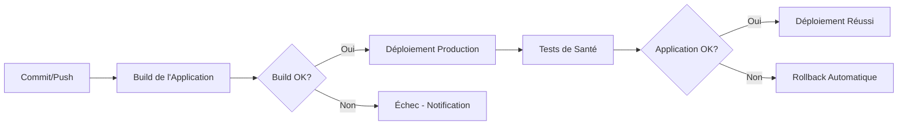

# Déploiement Automatique avec Render

Ce document décrit la configuration de déploiement automatique pour l'API BrightPath utilisant Render comme plateforme de déploiement.

## 🎯 Vue d'Ensemble

Le déploiement automatique permet d'automatiser le processus de mise en production en :
- Déployant automatiquement les nouvelles versions à chaque push
- Assurant la disponibilité continue de l'application
- Simplifiant le processus de mise à jour
- Réduisant les erreurs de déploiement manuel

## 🔧 Configuration Render

### 1. Service Web

```yaml
# render.yaml
services:
  - type: web
    name: brightpath-api
    env: node
    buildCommand: npm ci && npm run build
    startCommand: npm start
    envVars:
      - key: NODE_ENV
        value: production
      - key: PORT
        value: 10000
      - key: JWT_SECRET
        sync: false
      - key: JWT_REFRESH_SECRET
        sync: false
      - key: SUPABASE_URL
        sync: false
      - key: SUPABASE_ANON_KEY
        sync: false
      - key: OPENAI_API_KEY
        sync: false
```

### 2. Variables d'Environnement

Les variables sensibles sont configurées dans l'interface Render :

| Variable | Description | Exemple |
|----------|-------------|---------|
| `NODE_ENV` | Environnement d'exécution | `production` |
| `PORT` | Port d'écoute du serveur | `10000` |
| `JWT_SECRET` | Secret pour les tokens JWT | `votre-secret-jwt` |
| `JWT_REFRESH_SECRET` | Secret pour les refresh tokens | `votre-refresh-secret` |
| `SUPABASE_URL` | URL de la base de données Supabase | `https://xxx.supabase.co` |
| `SUPABASE_ANON_KEY` | Clé anonyme Supabase | `eyJ...` |
| `OPENAI_API_KEY` | Clé API OpenAI | `sk-...` |

## 🚀 Workflow de Déploiement

### 1. Déclenchement Automatique

Le déploiement se déclenche automatiquement à chaque :
- **Push sur `main`** : Déploiement automatique en production
- **Modification du code** : Rebuild et redéploiement

### 2. Étapes du Déploiement



### 3. Scripts de Build

```json
// package.json
{
  "scripts": {
    "build": "echo 'No build step required'",
    "start": "node server.js",
    "test": "jest",
    "test:coverage": "jest --coverage",
    "test:watch": "jest --watch",
    "lint": "eslint src/",
    "lint:fix": "eslint src/ --fix"
  }
}
```

## 🧪 Tests Locaux

### 1. Tests Unitaires

```bash
# Exécution des tests
npm test

# Tests avec couverture
npm run test:coverage

# Tests en mode watch
npm run test:watch
```

### 2. Tests de Santé

```javascript
// Ajouter dans server.js
app.get('/health', (req, res) => {
  res.json({
    status: 'OK',
    timestamp: new Date().toISOString(),
    uptime: process.uptime()
  });
});
```

### 3. Tests de Sécurité

```javascript
// tests/security/auth.test.js
describe('Sécurité', () => {
  it('devrait rejeter les tokens invalides', async () => {
    const response = await request(app)
      .get('/api/protected')
      .set('Authorization', 'Bearer invalid-token');
    expect(response.status).toBe(401);
  });
});
```

## 🔄 Déploiement Automatique

### 1. Configuration du Déploiement

Le déploiement automatique est configuré directement dans l'interface Render :

- **Auto-Deploy** : Activé par défaut
- **Branch** : `main`
- **Build Command** : `npm ci`
- **Start Command** : `npm start`

### 2. Rollback Automatique

En cas d'échec du déploiement :
- **Détection automatique** : Health check échoue
- **Rollback immédiat** : Retour à la version précédente
- **Notification** : Email de notification automatique
- **Logs** : Conservation des logs pour diagnostic

### 3. Configuration de Base

```yaml
# render.yaml (optionnel)
services:
  - type: web
    name: brightpath-api
    env: node
    buildCommand: npm ci
    startCommand: npm start
    envVars:
      - key: NODE_ENV
        value: production
      - key: PORT
        value: 10000
```

## 📊 Monitoring et Observabilité

### 1. Logs Centralisés

```javascript
// src/utils/logger.js
const winston = require('winston');

const logger = winston.createLogger({
  level: 'info',
  format: winston.format.json(),
  transports: [
    new winston.transports.Console(),
    new winston.transports.File({ filename: 'error.log', level: 'error' }),
    new winston.transports.File({ filename: 'combined.log' })
  ]
});
```

### 2. Métriques de Performance

```javascript
// src/middleware/metrics.js
const prometheus = require('prom-client');

const httpRequestDuration = new prometheus.Histogram({
  name: 'http_request_duration_seconds',
  help: 'Duration of HTTP requests in seconds',
  labelNames: ['method', 'route', 'status_code']
});
```

### 3. Alertes Automatiques

```yaml
# .render/alerts.yaml
alerts:
  - name: "Erreur 5xx"
    condition: "http_5xx_rate > 0.05"
    action: "notify_team"
  - name: "Temps de réponse élevé"
    condition: "response_time > 2s"
    action: "scale_up"
```

## 🔒 Sécurité du Déploiement

### 1. Gestion des Secrets

Les variables sensibles sont configurées dans l'interface Render :

- **Variables d'environnement** : Configurées dans l'onglet "Environment"
- **Variables secrètes** : Cochez "Secret" pour les masquer
- **Chiffrement** : Automatique pour les variables sensibles

### 2. Validation de Sécurité

```javascript
// tests/security/permissions.test.js
describe('Permissions', () => {
  it('devrait vérifier les permissions utilisateur', async () => {
    const response = await request(app)
      .get('/api/admin/users')
      .set('Authorization', `Bearer ${userToken}`);
    expect(response.status).toBe(403); // Non autorisé
  });
});
```

### 3. Tests de Sécurité Locaux

```bash
# Vérification des vulnérabilités
npm audit

# Tests de sécurité
npm test -- --testNamePattern="Sécurité"
```

## 📈 Métriques de Qualité

### 1. Couverture de Code

```yaml
# Configuration de couverture
coverage:
  threshold: 80
  reporters:
    - text
    - html
    - lcov
  exclude:
    - "tests/**"
    - "coverage/**"
    - "node_modules/**"
```

### 2. Performance

```javascript
// tests/performance/load.test.js
describe('Performance', () => {
  it('devrait supporter 100 requêtes simultanées', async () => {
    const requests = Array(100).fill().map(() => 
      request(app).get('/api/health')
    );
    const responses = await Promise.all(requests);
    responses.forEach(response => {
      expect(response.status).toBe(200);
    });
  });
});
```

### 3. Disponibilité

```yaml
# Monitoring de disponibilité
uptime:
  checkInterval: 30s
  timeout: 10s
  retries: 3
  endpoints:
    - /health
    - /api/status
```

## 🚨 Gestion des Incidents

### 1. Procédure d'Urgence

```markdown
## Procédure d'Incident

1. **Détection** : Monitoring automatique
2. **Alerte** : Notification immédiate
3. **Diagnostic** : Analyse des logs
4. **Action** : Rollback ou hotfix
5. **Communication** : Information aux utilisateurs
6. **Post-mortem** : Analyse et amélioration
```

### 2. Rollback Manuel

```bash
# Rollback vers une version spécifique
render rollback brightpath-api --version v1.2.3

# Rollback vers la version précédente
render rollback brightpath-api --previous
```

### 3. Hotfix

```bash
# Déploiement d'urgence
git tag hotfix/critical-fix
git push origin hotfix/critical-fix
```

## 📋 Checklist de Déploiement

### Avant le Déploiement
- [ ] Tous les tests passent localement
- [ ] Couverture de code > 80%
- [ ] Scan de sécurité réussi
- [ ] Documentation mise à jour
- [ ] Variables d'environnement configurées

### Pendant le Déploiement
- [ ] Tests automatiques exécutés
- [ ] Build réussi
- [ ] Déploiement sans erreur
- [ ] Tests de santé positifs
- [ ] Monitoring activé

### Après le Déploiement
- [ ] Vérification des fonctionnalités
- [ ] Tests de performance
- [ ] Validation des métriques
- [ ] Communication aux utilisateurs
- [ ] Documentation des changements

## 🔄 Configuration Avancée

### 1. Déploiement Manuel

Pour un déploiement manuel :
- **Interface Render** : Bouton "Manual Deploy"
- **Rollback** : Bouton "Rollback" vers la version précédente
- **Logs** : Consultation des logs de déploiement

### 2. Configuration des Environnements

```yaml
# render.yaml pour plusieurs environnements
services:
  - type: web
    name: brightpath-api-staging
    env: node
    buildCommand: npm ci
    startCommand: npm start
    envVars:
      - key: NODE_ENV
        value: staging
```

### 3. Optimisation des Performances

```javascript
// Configuration pour la production
const productionConfig = {
  compression: true,
  caching: true,
  rateLimiting: true,
  security: {
    helmet: true,
    cors: true
  }
};
```

---

## 🎯 Avantages de Render

### 🚀 **Simplicité et Rapidité**
- **Configuration minimale** : Déploiement en quelques clics
- **Automatisation complète** : CI/CD intégré sans configuration complexe
- **Déploiement instantané** : Mise en production en quelques secondes
- **Interface intuitive** : Dashboard clair et facile à utiliser

### 💰 **Coût-Efficacité**
- **Gratuit pour les projets personnels** : Plan gratuit généreux
- **Paiement à l'usage** : Seulement ce que vous utilisez
- **Pas de frais cachés** : Transparence totale des coûts
- **Optimisation automatique** : Mise à l'échelle intelligente

### 🔒 **Sécurité et Fiabilité**
- **SSL automatique** : Certificats HTTPS gratuits
- **CDN global** : Performance optimisée partout
- **Backup automatique** : Sauvegarde des données
- **Haute disponibilité** : 99.9% de temps de fonctionnement

### 🌍 **Scalabilité Globale**
- **Mise à l'échelle automatique** : Adaptation à la charge
- **Régions multiples** : Déploiement proche des utilisateurs
- **Load balancing** : Répartition automatique de la charge
- **Monitoring intégré** : Métriques en temps réel

### 🛠️ **Intégration Native**
- **Git intégré** : Déploiement automatique depuis GitHub/GitLab
- **Variables d'environnement** : Gestion sécurisée des secrets
- **Base de données** : PostgreSQL, Redis, MongoDB intégrés
- **Services tiers** : Intégration facile avec les APIs externes

### 📊 **Observabilité Complète**
- **Logs en temps réel** : Debugging facilité
- **Métriques détaillées** : Performance et utilisation
- **Alertes intelligentes** : Notifications automatiques
- **Analytics intégrés** : Compréhension de l'usage

### 🔄 **Workflow DevOps**
- **Environnements multiples** : Dev, staging, production
- **Rollback instantané** : Retour en arrière en un clic
- **Déploiement automatique** : Mise en production simplifiée
- **Tests locaux** : Qualité garantie avant déploiement

### 🌱 **Écosystème Riche**
- **Templates prêts à l'emploi** : Démarrage rapide
- **Documentation complète** : Guides et tutoriels
- **Support réactif** : Assistance technique de qualité
- **Communauté active** : Partage d'expériences

---

**Dernière mise à jour** : Décembre 2024  
**Version** : 1.0.0  
**Mainteneur** : Équipe BrightPath 